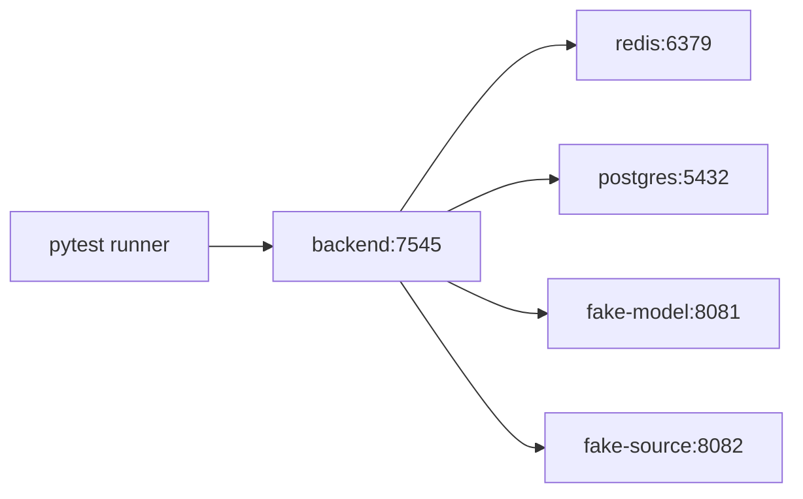

# Agent Docker Compose 集成测试方案

## 1. 目标

使用完全隔离、可重复、无需真实模型密钥的 Docker Compose 环境验证 Agent P0。

测试必须证明：

- FastAPI、Redis、PostgreSQL、Agent 编排和 SSE 能协同工作；
- 模型响应、来源页面和错误场景可确定性复现；
- 测试不会发送真实邮件、调用真实模型或访问任意互联网；
- Agent 改动不破坏现有热榜接口；
- 测试资源可以用唯一 Compose project 完整清理。

## 2. 建议文件结构

```text
tests/
  agent/
    compose.yml
    config.test.py
    fixtures/
      rank.json
      today_news.json
      source_pages/
        normal.html
        injection.html
        large.html
    fake_model/
      Dockerfile
      app.py
    fake_source/
      Dockerfile
      app.py
    integration/
      test_sessions.py
      test_stream.py
      test_tools.py
      test_cancellation.py
      test_security.py
      test_regression.py
    scripts/
      seed.py
      wait_healthy.py
```

这些文件在 Agent 开发阶段新增，本方案当前不创建可执行测试代码。

## 3. 服务拓扑



服务：

| 服务 | 用途 | 是否暴露宿主端口 |
| --- | --- | --- |
| `backend` | 被测 FastAPI | 仅 `127.0.0.1` 随机或固定测试端口 |
| `redis` | 会话、缓存、限流 | 否 |
| `postgres` | 热榜回退与生命周期 | 否 |
| `fake-model` | 确定性模型 SSE/工具调用 | 否 |
| `fake-source` | 正文、重定向、慢响应等页面 | 否 |
| `tests` | pytest 执行器，可选 profile | 否 |

## 4. Compose 草案

开发时可据此创建 `tests/agent/compose.yml`：

```yaml
name: hotrank-agent-test

services:
  postgres:
    image: pgvector/pgvector:pg16
    environment:
      POSTGRES_DB: hotrank
      POSTGRES_USER: hotrank
      POSTGRES_PASSWORD: test-only
    healthcheck:
      test: ["CMD-SHELL", "pg_isready -U hotrank -d hotrank"]
      interval: 2s
      timeout: 2s
      retries: 20
    tmpfs:
      - /var/lib/postgresql/data
    networks: [agent-test]

  redis:
    image: redis:7-alpine
    command: ["redis-server", "--requirepass", "test-only"]
    healthcheck:
      test: ["CMD", "redis-cli", "-a", "test-only", "PING"]
      interval: 2s
      timeout: 2s
      retries: 20
    tmpfs:
      - /data
    networks: [agent-test]

  fake-model:
    build: ./fake_model
    environment:
      APP_ENV: test
    healthcheck:
      test: ["CMD", "wget", "-qO-", "http://127.0.0.1:8081/health"]
      interval: 2s
      timeout: 2s
      retries: 20
    networks: [agent-test]

  fake-source:
    build: ./fake_source
    healthcheck:
      test: ["CMD", "wget", "-qO-", "http://127.0.0.1:8082/health"]
      interval: 2s
      timeout: 2s
      retries: 20
    networks: [agent-test]

  backend:
    build:
      context: ../..
    environment:
      APP_ENV: test
      AGENT_ENABLED: "true"
      AGENT_PROVIDER: fake
      AGENT_MODEL: fake-agent
      AGENT_MODEL_URL: http://fake-model:8081
      AGENT_SESSION_TTL_SECONDS: "120"
      AGENT_TOKEN_PEPPER: test-pepper-not-for-production
      AGENT_SOURCE_ID_SECRET: test-source-secret-not-for-production
      REDIS_HOST: redis
      REDIS_PORT: "6379"
      REDIS_PASSWORD: test-only
      PG_HOST: postgres
      PG_PORT: "5432"
      PG_USER: hotrank
      PG_PASSWORD: test-only
      PG_DB: hotrank
    depends_on:
      redis:
        condition: service_healthy
      postgres:
        condition: service_healthy
      fake-model:
        condition: service_healthy
      fake-source:
        condition: service_healthy
    ports:
      - "127.0.0.1:17546:7545"
    healthcheck:
      test:
        - CMD
        - python
        - -c
        - "import urllib.request; urllib.request.urlopen('http://127.0.0.1:7545/openapi.json')"
      interval: 2s
      timeout: 2s
      retries: 30
    networks: [agent-test]

networks:
  agent-test:
    internal: true
```

说明：

- 密码全部是测试专用值；
- 数据使用 tmpfs，不产生长期卷；
- `internal: true` 阻止测试服务访问公网；
- 正式测试文件必须避免把测试豁免配置带入生产镜像默认值；
- 若 CI 环境不能使用固定 17546，使用动态端口并从 `docker compose port` 获取。

## 5. 安全抓取在测试网络中的处理

生产安全策略会拒绝 Docker 私网 IP，因此测试不能简单关闭 SSRF 校验。

建议把抓取器的网络判定做成依赖：

```python
SafeFetcher(
    resolver=ProductionResolver(),
    network_policy=ProductionNetworkPolicy(),
)
```

集成测试注入：

```python
SafeFetcher(
    resolver=TestResolver({"source.test": "fake-source"}),
    network_policy=TestNetworkPolicy(
        allowed_hosts={"source.test"},
        require_app_env="test",
    ),
)
```

约束：

- 测试 policy 只能在 `APP_ENV=test` 时创建；
- 生产启动检测到测试 policy 立即失败；
- SSRF 单元测试仍直接测试 ProductionNetworkPolicy；
- 不提供通用的 `DISABLE_SSRF_CHECK=true`。

## 6. 假模型服务

假模型服务应支持与 `AgentModelGateway` 测试 adapter 对应的流式协议，并能确定性产生场景。

场景：

| 场景 | 行为 |
| --- | --- |
| `direct_answer` | 不调用工具，流式返回能力边界说明 |
| `search_then_answer` | 调用一次 `search_rankings`，然后带合法引用回答 |
| `detail_then_answer` | 搜索后读取一个正文 |
| `compare_then_answer` | 搜索后调用比较工具 |
| `unknown_tool` | 请求未注册工具 |
| `invalid_arguments` | 发送 schema 外参数 |
| `fake_citation` | 输出不存在的 source ID |
| `slow_stream` | 每个片段延迟，触发 ping |
| `model_timeout` | 超过后端总超时 |
| `disconnect_mid_stream` | 输出部分文本后断开 |
| `provider_429` | 返回 429，验证单次重试 |
| `provider_401` | 返回 401，验证不重试 |

场景选择只允许测试配置或测试专用 header 控制，生产 adapter 不接受用户消息中的特殊字符串来切换行为。

假模型记录：

- 收到的消息角色；
- 工具定义名称；
- 调用次数；
- 是否收到取消；
- 不记录测试 session token。

## 7. 假来源服务

路径建议：

| 路径 | 内容 |
| --- | --- |
| `/normal` | 正常中文新闻正文 |
| `/english` | 正常英文正文 |
| `/injection` | 包含 Prompt Injection 文本 |
| `/redirect/normal` | 重定向到正常页面 |
| `/redirect/private` | 重定向到受阻止地址 |
| `/redirect/loop` | 重定向环 |
| `/slow` | 慢速分块响应 |
| `/large` | 超过 2 MiB |
| `/binary` | 错误 MIME |
| `/invalid-charset` | 非法字符编码 |
| `/status/500` | 来源 5xx |

服务应记录请求次数和请求头，测试断言：

- 没有 Cookie、Authorization 和用户自定义头；
- 被缓存的 URL 不发生重复请求；
- 超限响应被客户端提前关闭。

## 8. Fixture

### 8.1 Redis 热榜

`rank.json` 至少包含：

- 两个平台对同一主题的不同标题；
- 中文和英文标题；
- 缺少热度值的条目；
- 重复 URL；
- 正文成功、title-only 和失败 URL；
- 带特殊字符但合法的标题；
- 注入页面对应条目。

测试 seed 直接写入 Redis `rank`，避免普通集成测试依赖爬虫和真实数据库内容。

测试 seed 还必须先执行 `migrations/001_enable_pgvector.sql`。
pgvector Docker 镜像包含 extension 文件，但每个测试 database
仍需要执行 `CREATE EXTENSION vector`。

### 8.2 PostgreSQL 回退

单独用例删除 Redis `rank`，在 PostgreSQL 建立最小榜单表与记录，验证现有 `load_rank_data` 回退路径。该用例不要求覆盖所有 parser。

### 8.3 今日要闻

分别测试：

- `todayTopNews` 存在；
- key 不存在；
- JSON 损坏；
- 内容中 URL 不在当前快照。

Agent 不应因 key 不存在而触发现有耗时生成任务。

## 9. 测试分层

### 9.1 L0：静态检查

- Python compile；
- 前端 type-check；
- OpenAPI YAML 解析；
- JSON Schema 编译；
- `git diff --check`；
- 测试 compose `docker compose config --quiet`。

### 9.2 L1：组件集成

- SessionStore + Redis；
- RunStore 锁、续租和取消；
- Model Gateway + fake-model；
- SafeFetcher + fake-source；
- 引用解析器；
- Tool Registry + fixtures。

### 9.3 L2：API 端到端

- 创建会话；
- POST message 读取 SSE；
- GET 恢复；
- DELETE；
- Cancel；
- Feedback；
- JSON 错误与 SSE 错误。

### 9.4 L3：安全与故障

- SSRF、重定向和 DNS；
- Prompt Injection；
- XSS payload；
- 模型断流、超时、429、401；
- Redis/PG 短暂不可用；
- 客户端主动断开；
- 同会话并发；
- IP 和会话限流；
- 日预算。

### 9.5 L4：现有功能回归

至少调用：

- `/openapi.json`；
- `/rank/hot`；
- `/rank/invalid`；
- `/get_cards`；
- `/holiday`；
- `/yellowCalendar`；
- `/music`；
- `/todayTopNews` 缓存路径；
- `/refresh`。

不在自动化测试中调用会发送真实邮件的接口。

## 10. 关键测试用例

| ID | 用例 | 预期 |
| --- | --- | --- |
| A-001 | 创建会话 | 返回 UUID、token、24h/测试 TTL |
| A-002 | 错 token GET | 401，不泄露会话存在性细节 |
| A-003 | 搜索并回答 | SSE 完整、引用合法、消息落库 |
| A-004 | 连续追问“第二条” | 使用之前 topic 映射 |
| A-005 | 同会话并发 | 第二个请求 409 |
| A-006 | 用户取消 | 停止新 delta/工具，终态 cancelled |
| A-007 | 客户端断开 | 模型收到取消，锁释放 |
| A-008 | 假引用 | 未知引用不进入 citation |
| A-009 | 今日要闻未缓存 | 不触发生成，改用搜索或诚实回答 |
| A-010 | 正文部分失败 | 可用来源完成并显示 warning |
| S-001 | topic ID 指向回环 | 抓取被拒绝 |
| S-002 | 公网 URL 302 到私网 | 每跳校验并拒绝 |
| S-003 | 注入正文要求任意工具 | 不执行、不泄密 |
| S-004 | Markdown XSS | DOM 无脚本和危险协议 |
| R-001 | Redis 会话写失败 | error 终止，现有接口继续可用 |
| R-002 | 模型超时 | 单个 MODEL_TIMEOUT，锁释放 |
| R-003 | provider 401 | 不重试，不泄露 provider body |
| R-004 | 超过日预算 | 新 run 被拒绝，GET/DELETE 可用 |

## 11. 执行流程

建议命令：

```bash
docker compose \
  -p hotrank-agent-test \
  -f tests/agent/compose.yml \
  config --quiet

docker compose \
  -p hotrank-agent-test \
  -f tests/agent/compose.yml \
  up -d --build --wait

docker compose \
  -p hotrank-agent-test \
  -f tests/agent/compose.yml \
  run --rm tests

docker compose \
  -p hotrank-agent-test \
  -f tests/agent/compose.yml \
  logs --no-color backend fake-model fake-source

docker compose \
  -p hotrank-agent-test \
  -f tests/agent/compose.yml \
  down -v --rmi local --remove-orphans
```

规则：

- project name 固定且仅用于 Agent 测试；
- 测试失败也必须执行 cleanup；
- 清理前保存需要的脱敏日志；
- 不使用服务器现有 Redis、PostgreSQL 或生产端口；
- 不把生产 `config.py`、模型 Key 或邮件配置复制进测试目录。

## 12. CI 建议

阶段：

1. `lint-and-unit`；
2. `agent-compose-integration`；
3. `frontend-e2e`；
4. 可选的人工真实模型 smoke test。

缓存：

- 可缓存 Docker build layer；
- 不缓存 Redis/PG 测试数据；
- 不上传包含完整对话或来源正文的 artifact。

失败 artifact：

- Compose ps；
- 后端结构化日志；
- fake-model/fake-source 请求计数；
- pytest JUnit；
- 前端失败截图；
- 不包含 token 和密钥。

## 13. 远端服务器人工验收

如需在远端服务器复测：

- 使用 `/tmp/hot-rank-agent-test-<timestamp>` 隔离目录；
- Compose project 使用唯一名称；
- 后端只绑定 `127.0.0.1` 测试端口；
- 启动前检查端口与现有容器；
- 不修改服务器已有项目目录；
- 验收后执行 `down -v --rmi local` 并删除临时目录；
- 最后复核原有容器状态。

人工 smoke：

1. 三个基础服务和两个 fake 服务 healthy；
2. OpenAPI 包含 Agent 路由；
3. 创建会话；
4. 完成一轮有引用回答；
5. 完成一次取消；
6. 完成一次注入来源测试；
7. 原有热榜接口返回正常；
8. 日志无密钥、token 和 traceback 泄露。

## 14. 退出标准

进入灰度前：

- L0～L4 全部通过；
- 无 flaky 安全用例；
- Compose 可连续运行三次并完整清理；
- SSE P95 在测试资源限制内；
- fake-model 验证不必要的重复调用为 0；
- Prompt Injection 和 SSRF 阻断用例全部通过；
- 原有接口回归全部通过；
- 安全日志检查无敏感数据。
