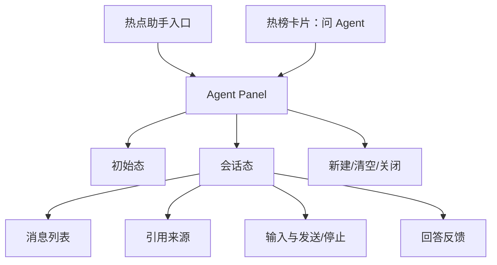

# Agent 前端交互与埋点

## 1. 范围

本文定义当前线上 Vue 3 前端 `vue-ui/` 的 Agent P0 交互、组件职责、状态、响应式行为、可访问性和埋点。

不覆盖：

- 旧版 `ui/`；
- 登录、分享、定时任务；
- Agent 后端编排细节；
- 视觉品牌的最终高保真稿。

## 2. 体验目标

- 用户无需学习 Prompt，也能通过推荐问题完成首次对话；
- 从热榜卡片进入 Agent 时，所选热点上下文清晰可见；
- 搜索、抓取、生成等状态透明，但不展示隐藏推理；
- 引用容易打开和核对；
- 取消、错误、重试和会话过期不会让用户丢失输入；
- 桌面和移动端均不遮挡关键操作；
- 键盘和屏幕阅读器可以完成完整流程。

## 3. 信息架构



## 4. 入口

### 4.1 全局入口

桌面端：

- 放在右下角固定区域，避免与现有音乐、RSS、日历等入口重叠；
- 文案“热点助手”，同时使用图标；
- 首次上线可展示一次轻量提示，不持续闪烁。

移动端：

- 使用圆形或短胶囊按钮；
- 避开浏览器底部安全区和页面主要浮动操作；
- 滚动时可以缩为图标，点击区域不小于 44×44 px。

### 4.2 热榜卡片入口

每条热点的更多操作中增加“问 Agent”：

- 不影响点击标题打开原文；
- 点击后不立即发送模型请求；
- 打开 Agent，并加入该热点上下文；
- 输入框获得焦点，placeholder 变为“关于这条热点，你想了解什么？”；
- 默认推荐“总结这条内容”“它为什么受到关注”“找找其他平台是否也在讨论”。

## 5. 桌面端布局

建议宽度 420 px，最大不超过视口宽度的 40%；高度覆盖可视区并保留站点顶部空间。

```text
┌─────────────────────────────────────┐
│ 热点助手                    ＋  ×    │
│ 基于当前热榜回答 · AI 内容提示       │
├─────────────────────────────────────┤
│ [已选热点：某标题……]          移除   │
├─────────────────────────────────────┤
│                                     │
│ 用户：今天有哪些 AI 热点？          │
│                                     │
│ 助手：今天主要有两类……[1]           │
│                                     │
│  来源                               │
│  [1] 标题 · 知乎热榜                │
│                                     │
│  有帮助？  👍  👎                   │
│                                     │
│  [只看国内平台] [再简短一点]         │
│                                     │
├─────────────────────────────────────┤
│ [输入问题……                    ]    │
│ 0/2000                 发送 / 停止   │
└─────────────────────────────────────┘
```

规则：

- Header 固定；
- Composer 固定；
- 消息区域独立滚动；
- 新 delta 到达时，只有用户仍接近底部才自动滚动；
- 用户向上阅读时显示“回到最新”按钮，不强制拉回底部；
- 来源可以折叠，但正文中的 `[n]` 始终可点击。

## 6. 移动端布局

- Agent 作为全屏层或独立路由；
- 使用 `100dvh`，适配移动浏览器地址栏；
- 顶部提供返回按钮；
- Composer 根据软键盘高度调整；
- 支持 safe-area；
- 来源卡片纵向排列；
- 不使用 hover 才能发现的操作；
- 打开外链返回后恢复会话与滚动位置。

## 7. 页面状态

### 7.1 初始态

内容：

- 标题：热点助手；
- 简述：基于当前热榜进行检索、总结和比较；
- 提示：AI 生成内容，请以原始来源为准；
- 4 个推荐问题；
- “请勿输入敏感个人信息”的简短隐私说明。

不展示空白聊天气泡。

### 7.2 创建会话中

- 用户点击推荐问题或发送后再创建会话；
- 发送按钮进入 loading，防止重复点击；
- 创建失败保留输入；
- 不为仅打开面板的用户创建 Redis 会话。

### 7.3 生成态

显示：

- 已提交的用户消息；
- 空 Assistant 消息容器；
- 当前 status；
- 流式正文；
- “停止生成”按钮。

禁用：

- 同会话再次发送；
- 清空会话前不提示；
- 修改已提交消息。

允许：

- 关闭面板，生成继续或取消必须产品统一。P0 默认关闭面板不取消，只隐藏 UI；页面卸载或断开则后端取消；
- 打开已经出现的引用；
- 点击停止。

### 7.4 完成态

显示：

- 最终 Markdown；
- 引用来源；
- 2～3 个追问建议；
- 有帮助/没帮助；
- 恢复可输入状态。

### 7.5 无结果态

回答区域展示：

> 当前热榜中暂未找到足够相关的内容。你可以换一个关键词，或减少平台限制。

提供：

- 去掉平台限制；
- 查看今天最热；
- 编辑原问题。

### 7.6 错误态

| 错误 | UI |
| --- | --- |
| `SESSION_EXPIRED` | 提示过期，保留未发送输入，提供“开始新对话” |
| `RATE_LIMITED` | 显示可重试倒计时 |
| `MODEL_TIMEOUT` | 保留部分回答并标“未完成”，提供重试 |
| `SOURCE_FETCH_FAILED` | 允许基于标题继续，明确来源限制 |
| `AGENT_DISABLED` | 隐藏输入，提示暂不可用 |
| `STREAM_INTERRUPTED` | 提供恢复会话和重试 |
| `RUN_CANCELLED` | 中性提示“已停止生成” |

错误文案不得显示 provider 名、内部 URL、状态栈和请求体。

### 7.7 会话删除

用户点击“新建对话”：

- 当前无内容时直接新建；
- 当前有内容时弹出确认；
- 确认后调用 DELETE；
- 删除失败时不在本地假装成功；
- 删除成功后清除 sessionStorage 和消息。

## 8. 上下文热点

上下文对象前端只保存：

```ts
interface SelectedTopic {
  topicId: string
  title: string
  platform: string
}
```

不保存：

- 原始正文；
- 任意用户输入 URL；
- source ID secret；
- 后端快照内部信息。

交互：

- 最多选 5 条；
- 超过时提示上限；
- 相同 topic 不重复添加；
- 用户发送后，当前轮 context 固化；
- 发送后的历史消息仍显示当时上下文，后续移除不改历史。

## 9. 消息与 Markdown

### 9.1 用户消息

- 保留换行；
- 使用纯文本；
- URL 不自动变成可执行 HTML；
- 超长在发送前阻止并显示计数。

### 9.2 Assistant 消息

使用现有 `markdown-it`，配置：

- `html: false`；
- 链接统一经过协议校验；
- 渲染后再经过 sanitizer；
- 禁止 iframe、object、form、style、svg；
- 代码块 P0 可显示，但 Agent 能力边界不鼓励生成可执行操作；
- citation `[n]` 渲染为按钮或安全锚点。

为了性能：

- SSE delta 先拼接到字符串；
- 每 50～100ms 批量触发一次 Markdown 渲染；
- 完成事件后做最终渲染；
- 不为每个 token 写埋点。

## 10. 组件职责

### `AgentLauncher.vue`

- 展示入口；
- 接受 unread/feature enabled 状态；
- 只发出 open 事件。

### `AgentPanel.vue`

- 桌面抽屉/移动全屏容器；
- Header、焦点陷阱、关闭和会话菜单；
- 不直接处理网络。

### `AgentMessage.vue`

- 渲染 user/assistant 消息；
- Markdown、安全引用和未完成状态；
- 发出 citation click、feedback 事件。

### `AgentComposer.vue`

- 输入、字符计数、发送、停止；
- 处理 IME composition，中文输入法组合期间 Enter 不发送；
- Enter 发送、Shift+Enter 换行；
- 移动端默认保留明确发送按钮。

### `AgentSources.vue`

- 来源编号、标题、平台、热度、更新时间、抓取状态；
- 安全打开外链；
- 不使用 `v-html` 渲染来源字段。

### `AgentStatus.vue`

- 根据 stage 本地化状态；
- 对屏幕阅读器使用节制的 live region；
- ping 不触发可见更新。

### `useAgentSession.ts`

唯一网络与状态协调层：

- 创建、恢复、删除会话；
- sessionStorage；
- SSE POST 解析；
- AbortController；
- cancel；
- 消息和 citation 合并；
- 重试；
- 埋点调用。

## 11. 前端状态模型

```ts
type AgentUiState =
  | 'closed'
  | 'idle'
  | 'creating_session'
  | 'connecting'
  | 'streaming'
  | 'cancelling'
  | 'completed'
  | 'cancelled'
  | 'error'

interface AgentState {
  uiState: AgentUiState
  sessionId: string | null
  sessionToken: string | null
  activeRunId: string | null
  messages: AgentMessage[]
  selectedTopics: SelectedTopic[]
  stage: AgentStage | null
  error: AgentPublicError | null
}
```

状态必须集中转换，不允许多个组件分别修改 `activeRunId`。

## 12. 会话本地存储

P0 默认使用 `sessionStorage`：

| key | 内容 |
| --- | --- |
| `hotday-agent-session-id` | session UUID |
| `hotday-agent-session-token` | opaque token |
| `hotday-agent-panel-open` | 可选 UI 状态 |

理由：

- 页面刷新后仍可恢复；
- 关闭标签页后自动清理；
- 不跨标签页和长期保留；
- 比 localStorage 更符合匿名 24 小时会话的最小化原则。

注意：

- Web Storage 不能抵御 XSS；
- token 不进入 URL、analytics、错误上报；
- 会话过期或删除立即清理；
- 如果后续改用 localStorage，需要重新做隐私和 XSS 评审。

## 13. SSE 前端处理

伪代码：

```ts
const response = await fetch(url, {
  method: 'POST',
  headers: {
    Accept: 'text/event-stream',
    'Content-Type': 'application/json',
    'X-Agent-Session-Token': token,
  },
  body: JSON.stringify(payload),
  signal: abortController.signal,
})

if (!response.ok || !response.headers.get('content-type')?.includes('text/event-stream')) {
  throw await parseJsonError(response)
}

for await (const event of parseSse(response.body)) {
  applyAgentEvent(event)
}
```

实现要求：

- parser 支持网络 chunk 任意切分；
- 不假设一 chunk 对应一事件；
- 处理 `\r\n` 和 `\n`；
- `done/error` 后忽略多余事件并记录协议错误；
- EOF 没有终止事件时进入 `STREAM_INTERRUPTED`；
- AbortError 与用户取消、页面卸载分别处理。

## 14. 可访问性

### 14.1 键盘

- Launcher 可 Tab 聚焦；
- 打开时焦点移动到面板标题或输入框；
- 桌面抽屉使用 focus trap；
- Esc 关闭面板，但生成中需提示“关闭不会停止生成”；
- 关闭后焦点返回原入口或触发的热榜卡片；
- 引用卡片和反馈按钮可键盘操作；
- Enter/Shift+Enter 行为可发现。

### 14.2 屏幕阅读器

- 面板使用 `role="dialog"`、`aria-modal` 和可访问名称；
- status 使用 `aria-live="polite"`，避免每个 delta 都播报；
- 完成后播报“回答已生成”；
- 错误使用合适的 alert；
- 图标按钮有文本 label；
- 不用颜色作为唯一状态信息。

### 14.3 视觉

- 文本和背景满足 WCAG AA 对比度；
- 焦点环明显；
- 点击目标至少 44×44 px；
- 支持 `prefers-reduced-motion`；
- 流式光标动画可关闭。

## 15. 国际化

所有 UI 文案进入：

- `vue-ui/src/locales/zh.ts`
- `vue-ui/src/locales/en.ts`

不把服务端 `status.message` 作为唯一文案源。前端根据 `stage`、`error.code` 映射。

用户消息原样保留；Agent 回答语言由请求 `locale` 决定。

## 16. 埋点原则

- 不记录完整用户问题；
- 不记录回答正文；
- 不记录来源标题和完整 URL；
- 不记录 session token；
- session ID、run ID 只使用不可逆短哈希或当前页面临时关联 ID；
- 不为每个 SSE delta 上报；
- 性能数值在客户端聚合后上报；
- 埋点失败不影响 Agent。

## 17. 事件表

公共属性：

```text
event_version
locale
viewport_type        desktop | mobile
session_ref          ephemeral/hash
run_ref              ephemeral/hash, 可空
entry_source         global | rank_card | suggestion
feature_version
prompt_version       完成事件可用
```

| 事件名 | 触发点 | 关键属性 |
| --- | --- | --- |
| `agent_entry_impression` | 入口首次可见 | `entry_source` |
| `agent_launcher_click` | 点击全局入口 | `panel_was_open` |
| `agent_panel_open` | 面板完成打开 | `entry_source` |
| `agent_panel_close` | 主动关闭 | `run_active`, `conversation_turns` |
| `agent_suggestion_click` | 点击推荐问题 | `suggestion_id` |
| `agent_topic_context_add` | 从卡片加入上下文 | `platform`, `context_count` |
| `agent_topic_context_remove` | 移除上下文 | `platform`, `context_count` |
| `agent_session_create` | 创建结束 | `result`, `duration_ms`, `error_code` |
| `agent_session_restore` | 恢复结束 | `result`, `message_count`, `error_code` |
| `agent_message_submit` | 用户发送 | `input_length_bucket`, `context_count`, `turn_index` |
| `agent_run_connected` | 收到 meta | `connect_ms` |
| `agent_first_delta` | 第一段正文 | `first_delta_ms`, `tool_stage_seen` |
| `agent_run_complete` | 收到 done | `duration_ms`, `citation_count`, `finish_reason`, `output_length_bucket` |
| `agent_run_error` | JSON/SSE/网络错误 | `error_code`, `retryable`, `partial_content` |
| `agent_run_cancel` | 用户点击停止 | `elapsed_ms`, `stage` |
| `agent_run_retry` | 用户重试 | `previous_error_code` |
| `agent_citation_click` | 点击来源 | `citation_position`, `platform`, `detail_status` |
| `agent_feedback_submit` | 提交反馈 | `rating`, `reason` |
| `agent_session_clear` | 清空成功 | `conversation_turns` |

长度 bucket：

```text
1-20
21-100
101-500
501-1000
1001-2000
```

禁止属性：

- `message_text`
- `answer_text`
- `session_token`
- `source_url`
- `source_title`
- 原始 IP
- provider API 错误正文

## 18. 指标计算

| 产品指标 | 埋点计算 |
| --- | --- |
| 入口点击率 | launcher_click / entry_impression |
| 对话启动率 | message_submit / panel_open |
| 对话成功率 | run_complete / message_submit |
| 追问率 | turn_index >= 2 的 session / 有完成回答的 session |
| 引用点击率 | citation_click / citation_count 总和 |
| 取消率 | run_cancel / message_submit |
| 重试率 | run_retry / run_error |
| 正向反馈率 | feedback up / feedback total |
| 首字 P95 | first_delta_ms |
| 完整响应 P95 | run_complete.duration_ms |

服务端指标是费用、provider 状态和真实完成状态的事实源；客户端指标用于体验分析。两者通过脱敏 run ref 关联。

## 19. 交互验收

- [ ] 桌面、移动端入口不遮挡现有主要功能；
- [ ] 首次使用无需输入即可通过推荐问题开始；
- [ ] 热榜卡片上下文可见、可移除且最多 5 条；
- [ ] 中文输入法组合期间 Enter 不误发送；
- [ ] 流式期间可停止；
- [ ] 用户向上阅读时不被自动滚到底部；
- [ ] `[n]` 与来源卡片一一对应；
- [ ] title-only 来源明确标注；
- [ ] 错误保留用户输入和可用的部分回答；
- [ ] 页面刷新可恢复当前标签页会话；
- [ ] token 不出现在 URL、日志和埋点；
- [ ] Markdown/XSS 测试通过；
- [ ] 键盘和屏幕阅读器可完成主流程；
- [ ] 中英文文案完整；
- [ ] 埋点不包含消息、回答、URL 或标题。

## 20. 设计评审待确认

- 全局入口与现有悬浮按钮的最终位置；
- 桌面抽屉宽度和移动端是否使用独立路由；
- 关闭面板时生成继续的默认行为；
- 是否在 P0 展示来源热度；
- 采用哪一个 sanitizer；
- 现有 analytics 接入方式；
- 是否需要一次性新功能引导。
