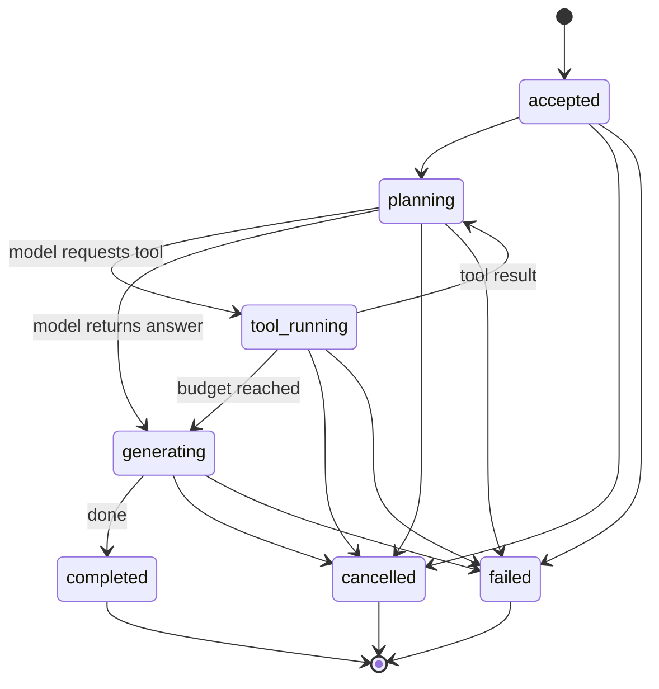
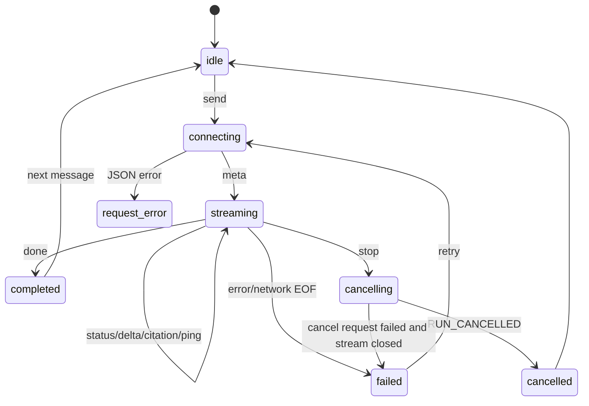
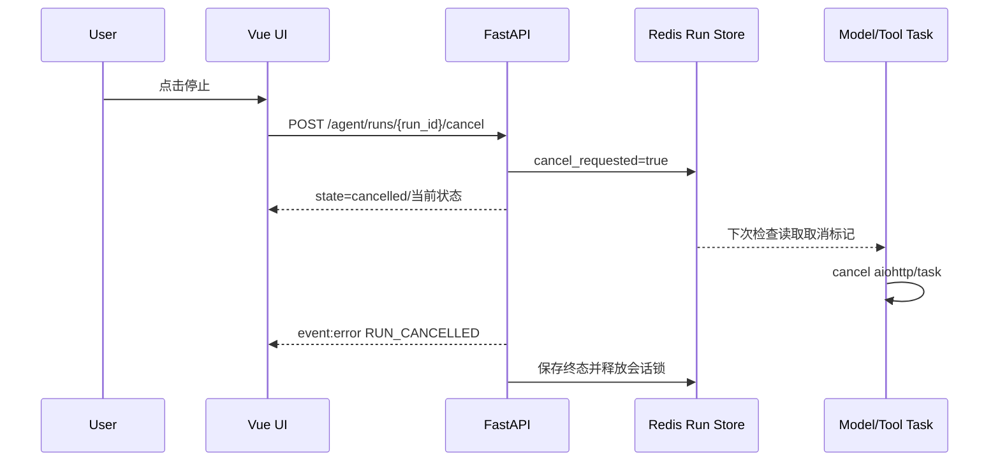

# Agent SSE 协议与状态机

## 1. 目的

本文定义 `POST /agent/sessions/{session_id}/messages` 的流式传输协议。它是前后端共同遵守的实现契约，字段定义与 `openapi.yaml` 保持一致。

## 2. 传输约定

- HTTP 方法：`POST`
- 请求：`application/json`
- 成功响应：`text/event-stream; charset=utf-8`
- 客户端实现：`fetch` + `ReadableStream`
- 事件编码：UTF-8
- 代理缓存：关闭
- 服务端心跳：最长每 15 秒一次
- 运行级自动续传：不支持

推荐请求头：

```http
Accept: text/event-stream
Content-Type: application/json
X-Agent-Session-Token: <opaque-token>
```

推荐响应头：

```http
Content-Type: text/event-stream; charset=utf-8
Cache-Control: no-cache, no-transform
Connection: keep-alive
X-Accel-Buffering: no
```

## 3. SSE 帧格式

每个事件使用：

```text
id: <本次连接内递增整数>
event: <事件类型>
data: <单行 JSON>

```

规则：

- 一个空行结束一个事件；
- `data` 必须是合法 JSON，不发送非 JSON 自由文本；
- JSON 中的换行使用 `\n` 转义；
- `id` 从 1 开始，仅保证单次连接内递增；
- 未知事件必须被客户端忽略并记录 debug 日志；
- `done` 或 `error` 后服务端关闭响应。

## 4. 运行状态机



### 4.1 状态说明

| 状态 | 是否终态 | 说明 |
| --- | --- | --- |
| `accepted` | 否 | 已创建 run，尚未调用模型 |
| `planning` | 否 | 模型判断回答方式或选择工具 |
| `tool_running` | 否 | 正在执行一个固定工具 |
| `generating` | 否 | 正在输出最终回答 |
| `completed` | 是 | 正常完成 |
| `cancelled` | 是 | 用户取消或客户端断开 |
| `failed` | 是 | 运行错误 |

同一会话不能同时存在两个非终态运行。

## 5. 事件顺序

正常运行：

```text
meta
(status | ping)*
(delta | citation | status | ping)*
done
```

失败运行：

```text
meta
(status | delta | citation | ping)*
error
```

约束：

- `meta` 必须是第一个业务事件，且只出现一次；
- `done` 与 `error` 只能出现一个；
- `done` 或 `error` 必须是最后一个业务事件；
- `delta` 可以出现零次；
- `citation` 同一 `source_id` 只出现一次；
- `ping` 不改变状态；
- 建立 SSE 前的参数、鉴权或限流错误直接返回 JSON，不发送 SSE。

## 6. 事件定义

### 6.1 `meta`

表示运行已经创建。

```json
{
  "run_id": "0191ec64-6ef5-7dc1-a5ee-20c82e47a7b1",
  "assistant_message_id": "0191ec64-a71f-7a68-97d0-794857b1f31a",
  "started_at": "2026-08-06T10:00:00+08:00"
}
```

前端动作：

- 保存 `run_id`，用于停止生成；
- 创建空的 Assistant 消息；
- 将 UI 状态设为生成中。

### 6.2 `status`

提供简短、可本地化的进度状态。

```json
{
  "stage": "searching",
  "message": "正在检索热榜"
}
```

`stage` 枚举：

| stage | 对应运行状态 | 默认中文 |
| --- | --- | --- |
| `planning` | `planning` | 正在理解问题 |
| `searching` | `tool_running` | 正在检索热榜 |
| `fetching` | `tool_running` | 正在读取来源 |
| `comparing` | `tool_running` | 正在比较热点 |
| `generating` | `generating` | 正在整理回答 |

前端优先使用 `stage` 映射本地文案；服务端 `message` 仅作为兼容回退。这样切换语言时无需依赖服务端中文。

禁止在 `message` 中输出：

- 模型隐藏推理；
- 完整 Prompt；
- 内部 URL、凭证或异常栈；
- “我认为下一步应该……”等推理过程。

### 6.3 `delta`

追加回答文本。

```json
{
  "text": "今天值得关注的科技热点包括"
}
```

规则：

- 客户端按收到顺序直接追加；
- `text` 可以包含 Markdown；
- 服务端不得拆断 UTF-8 字符；
- 单个事件建议不超过 4 KiB；
- 空字符串不发送；
- 前端渲染时对 Markdown 生成的 HTML 做清洗；
- 前端应批量刷新 DOM，避免每个 token 触发一次完整 Markdown 渲染。

### 6.4 `citation`

注册回答中的一个来源。

```json
{
  "citation": {
    "number": 1,
    "source_id": "src_C5aQpS...",
    "title": "示例热点标题",
    "url": "https://example.com/news",
    "platform": "知乎",
    "hot_value": "123456",
    "rank_updated_at": "2026-08-06T09:00:00+08:00",
    "detail_status": "fetched"
  }
}
```

规则：

- `number` 按来源在回答中首次出现的顺序生成；
- 回答正文使用 `[1]` 与该事件匹配；
- 前端允许先收到正文编号、后收到 citation；
- URL 必须来自服务端允许列表；
- `detail_status=title_only` 时，来源卡片显示“仅依据榜单信息”；
- 同一 URL 只保留一个来源。

#### 引用标记流式处理

模型内部输出格式为：

```text
结论内容[[source:src_C5aQpS]]
```

服务端维护一个很小的尾部缓冲区，避免把未完成的 `[[source:` 标记发送给前端：

1. 普通文本立即转为 `delta`；
2. 完整且合法的来源标记替换为 `[n]`；
3. 首次遇到来源时发送对应 `citation`；
4. 未知来源标记删除，并记录质量指标；
5. 流结束时未闭合的标记作为普通文本转义或删除。

### 6.5 `ping`

连接心跳。

```json
{
  "timestamp": "2026-08-06T10:00:15+08:00"
}
```

前端不展示，只更新“最后收到服务端数据”的时间。

若 30 秒未收到任何事件：

- 前端显示“连接较慢，仍在等待”；
- 不立即重试同一消息；
- 达到客户端总超时后主动取消并进入错误态。

### 6.6 `done`

正常终止。

```json
{
  "message_id": "0191ec64-a71f-7a68-97d0-794857b1f31a",
  "finish_reason": "stop",
  "citation_count": 3,
  "usage": {
    "input_tokens": 1200,
    "output_tokens": 380
  },
  "completed_at": "2026-08-06T10:00:12+08:00"
}
```

`finish_reason`：

- `stop`：正常完成；
- `limit`：达到工具、token、时间或费用预算；
- `cancelled` 不使用 `done`，使用 `error` 的 `RUN_CANCELLED`。

前端动作：

- 停止 loading；
- 固化回答和引用；
- 展示追问建议与反馈入口；
- 清除本地 active run；
- 可异步 GET 会话校验最终落库结果。

`usage` 可缺省。前端不向普通用户展示 token 数量。

### 6.7 `error`

异常或取消终止。

```json
{
  "code": "MODEL_TIMEOUT",
  "message": "生成超时，请重试",
  "retryable": true,
  "partial_content_saved": false
}
```

流内错误码：

| code | retryable | 说明 |
| --- | --- | --- |
| `RUN_CANCELLED` | 否 | 用户主动停止或连接断开 |
| `MODEL_TIMEOUT` | 是 | 模型总时间超过限制 |
| `MODEL_UNAVAILABLE` | 是 | 模型提供商暂时不可用 |
| `TOOL_TIMEOUT` | 是 | 工具累计超时 |
| `SOURCE_FETCH_FAILED` | 是 | 必要来源全部失败 |
| `BUDGET_EXCEEDED` | 否 | 本轮或当日预算已用完 |
| `INTERNAL_ERROR` | 是 | 未分类服务异常 |

前端动作：

- 停止 loading；
- 保留已经收到的部分文字，但明确标为未完成；
- `RUN_CANCELLED` 显示“已停止生成”，不显示红色错误；
- `retryable=true` 时展示重试；
- 重试创建新 run，不复用旧 `run_id`。

## 7. 建流前 JSON 错误

以下错误在 SSE 响应建立前返回：

| HTTP | code | 场景 |
| --- | --- | --- |
| 400 | `INVALID_REQUEST` | 空消息、字段超长、topic ID 无效 |
| 401 | `SESSION_UNAUTHORIZED` | token 错误 |
| 404 | `SESSION_EXPIRED` | 会话不存在或过期 |
| 409 | `RUN_IN_PROGRESS` | 同会话已有运行 |
| 429 | `RATE_LIMITED` | IP 或会话限流 |
| 503 | `AGENT_DISABLED` | 功能关闭 |
| 503 | `AGENT_BUSY` | 全局并发达到上限 |

前端必须先检查 `response.ok` 和 `Content-Type`，再决定按 JSON 还是 SSE 解析。

## 8. 前端解析状态机



客户端必须区分：

- 用户主动停止；
- 服务端业务错误；
- 网络连接中断；
- SSE 正常 `done` 后关闭。

没有收到 `done` 或 `error` 就 EOF，视为 `STREAM_INTERRUPTED`。

## 9. 取消时序



前端发出取消请求后仍继续读取原 SSE，直到：

- 收到 `RUN_CANCELLED`；
- 收到其他终止事件；
- 或取消等待超时。

## 10. 恢复与重试

首版不实现基于 `Last-Event-ID` 的运行级续传。

页面刷新或网络中断后：

1. 前端使用 session token 调用 GET 会话；
2. 已完成并落库的回答会恢复；
3. 仍为 active 的 run 只显示“上次生成未完成”；
4. 用户可以取消旧 run 或新建会话；
5. 不自动重复发送原问题，防止重复模型消费。

重试规则：

- 重试会新增一条 run，但可复用原用户消息文本；
- UI 标记其为重试，不重复渲染两条用户消息；
- 后端仍执行完整的限流和预算检查。

## 11. Nginx 与压缩

SSE 路径必须：

- `proxy_buffering off`；
- `proxy_cache off`；
- `gzip off` 或确认代理不会攒包；
- `proxy_read_timeout` 大于服务端模型总超时；
- 不由 CDN 转换或缓存。

上线前用 `curl -N` 验证每个事件能即时到达，而不是结束后一次性输出。

## 12. 协议测试用例

至少覆盖：

1. `meta → status → delta → citation → done`；
2. 多个 delta 顺序正确；
3. 无工具直接回答；
4. 工具失败后仍基于已有信息完成；
5. 模型超时发送单个 error；
6. 用户取消后没有新的 delta；
7. 15 秒无业务事件时发送 ping；
8. 未知引用标记不泄漏到正文；
9. 未知 SSE 事件被客户端忽略；
10. 网络 EOF 且没有终止事件时客户端进入中断态；
11. JSON 429 不被误当作 SSE；
12. 中文字符被分块时不出现乱码。
