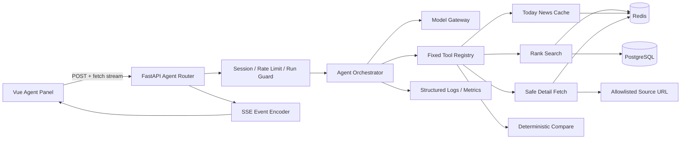

# Agent 技术设计

| 项目 | 内容 |
| --- | --- |
| 状态 | Draft |
| 对应 PRD | `docs/agent-feature-prd.md` v0.1 |
| 适用范围 | P0 只读热点 Agent |
| 目标技术栈 | FastAPI、Redis、PostgreSQL、Vue 3 |

## 1. 设计目标

本设计在不影响现有热榜接口的前提下，增加一个可流式响应、可取消、支持受控工具调用的热点 Agent。

必须满足：

- Agent 只访问当前热榜、今日要闻缓存和热榜允许列表中的网页；
- 事实性回答可追溯到来源；
- 匿名会话有明确的所有权校验和 24 小时 TTL；
- Agent 故障不影响 `/rank/hot` 等现有接口；
- 模型提供商可以替换，编排器不依赖某一家工具调用格式；
- 单轮工具、抓取、模型时间和 token 都有预算；
- 可通过功能开关整体关闭。

## 2. 总体架构



### 2.1 请求链路

1. Router 校验功能开关、会话令牌、输入长度和限流。
2. Run Guard 为会话获取互斥锁，避免同一会话并发修改上下文。
3. Router 返回 SSE 响应，并创建本轮 `run_id`。
4. Orchestrator 读取最近会话、热点卡片上下文和预算。
5. Model Gateway 请求模型决定回答或调用固定工具。
6. Tool Registry 校验参数、预算和取消状态后执行工具。
7. Orchestrator 将结构化工具结果交回模型，最多循环 4 次。
8. 模型输出通过 SSE `delta` 事件发送给前端。
9. 服务端校验引用、保存最终消息、发送 `done`。
10. 无论成功、失败或取消，都释放会话锁并记录运行指标。

## 3. 代码结构

```text
hotrank/
  routers/
    agent.py                 # HTTP、SSE、鉴权、限流
  agent/
    orchestrator.py          # 工具循环、预算、回答完成
    model_gateway.py         # provider-neutral 接口
    events.py                # SSE 事件类型和编码
    errors.py                # 业务错误码
    config.py                # Agent 配置读取与校验
    prompts.py               # Prompt 版本与渲染
    session_store.py         # Redis 会话与消息
    run_store.py             # 运行状态、锁、取消标记
    citations.py             # source_id、引用去重与校验
    tool_registry.py         # 固定工具注册表
    tools/
      search_rankings.py
      get_topic_detail.py
      get_today_news.py
      compare_topics.py
  services/
    agent_feedback.py
```

前端：

```text
vue-ui/src/
  api/
    agent.ts
  composables/
    useAgentSession.ts
  components/agent/
    AgentLauncher.vue
    AgentPanel.vue
    AgentMessage.vue
    AgentComposer.vue
    AgentSources.vue
    AgentStatus.vue
```

## 4. 核心组件

### 4.1 Agent Router

职责：

- 解析和校验请求；
- 校验 `X-Agent-Session-Token`；
- 调用 SlowAPI 或专用 Redis 限流器；
- 生成 `run_id`；
- 监听客户端断开；
- 将内部事件编码为 SSE；
- 将内部异常映射为稳定错误码。

消息接口使用 `POST`，前端通过 `fetch()` 读取 `ReadableStream`。浏览器原生 `EventSource` 仅支持 GET，不用于本接口。

Router 不负责：

- 选择工具；
- 拼接 Prompt；
- 抓取 URL；
- 直接调用模型提供商。

### 4.2 Session Store

会话令牌：

- `session_id` 使用 UUIDv4；
- `session_token` 使用至少 256 bit 密码学随机值；
- 只向客户端返回一次明文 token；
- Redis 只保存 `SHA-256(token + server_pepper)`；
- 校验使用常量时间比较；
- 日志不记录 token。

建议 Redis 数据：

```text
agent:session:{session_id}  HASH
  token_hash
  locale
  created_at
  updated_at
  expires_at
  prompt_version

agent:messages:{session_id} LIST
  JSON Message
```

Message 最小结构：

```json
{
  "message_id": "uuid",
  "role": "user",
  "content": "用户输入",
  "created_at": "RFC3339",
  "citations": [],
  "run_id": "uuid"
}
```

规则：

- 每次读取或写入有效会话时刷新两个 key 的 TTL；
- 最多保留 40 条消息，即 20 轮；
- 保存前限制用户消息 2,000 字符、Assistant 消息 12,000 字符；
- 会话元数据存在而消息 key 丢失时按空会话恢复；
- 会话删除使用 pipeline 一次删除全部相关 key。

### 4.3 Run Store 与并发

```text
agent:run:{run_id} HASH
  session_id
  state
  cancel_requested
  started_at
  updated_at

agent:session-lock:{session_id} STRING run_id
```

并发策略：

- 同一会话同一时间只允许一个运行；
- 使用 `SET key run_id NX PX 60000` 获取锁；
- 长运行每 10 秒续租；
- 只有持有相同 `run_id` 的进程可以释放锁；
- 锁获取失败返回 HTTP 409 `RUN_IN_PROGRESS`；
- 运行结束后保留运行状态 1 小时，便于取消幂等和诊断。

取消策略：

- 客户端断开时设置本地取消事件；
- `/agent/runs/{run_id}/cancel` 设置 Redis 取消标记；
- 每次模型片段、工具执行前后和抓取分块读取时检查取消状态；
- aiohttp 请求使用独立 task，确认取消后调用 `task.cancel()`；
- 多进程部署下 Redis 标记是跨进程事实源，本地 task registry 只是快速路径。

### 4.4 Orchestrator

输入：

```python
AgentRunInput(
    session_id,
    run_id,
    locale,
    user_message,
    selected_topic_ids,
    history,
    budget,
)
```

编排循环：

```text
prepare context
while model requests tools:
  validate tool name
  validate arguments
  check remaining budget
  execute tool
  append structured tool result
  stop when tool_calls == 4
stream final answer
validate citations
persist messages
```

首版不使用并行工具调用。原因是并行抓取会增加预算、取消和引用排序复杂度；后续可在 `get_topic_detail` 工具内部并发读取受控数量的 URL。

强制结束条件：

- 工具调用达到 4 次；
- 抓取来源达到 5 个；
- 工具累计超过 15 秒；
- 模型累计超过 45 秒；
- 总 token 或费用预算达到上限；
- 用户取消；
- 客户端断开且未启用后台完成。

首版客户端断开后直接取消，不在后台继续生成。

### 4.5 Model Gateway

接口草案：

```python
class AgentModelGateway(Protocol):
    async def stream(
        self,
        *,
        messages: list[ModelMessage],
        tools: list[ToolDefinition],
        timeout_seconds: float,
        cancel_event: asyncio.Event,
    ) -> AsyncIterator[ModelEvent]:
        ...
```

统一 `ModelEvent`：

- `text_delta`
- `tool_call_start`
- `tool_call_delta`
- `tool_call_end`
- `usage`
- `finish`

Provider Adapter 将 OpenAI 兼容和 Gemini 的响应转换为统一事件。Orchestrator 不读取 provider 原始 SSE。

与现有 `hotrank/model_client.py` 的关系：

- 现有 `chat_with_model()` 暂时保留，避免影响今日要闻；
- 新 Agent 先使用独立 `AgentModelGateway`；
- 验证稳定后，再提取公共 HTTP、超时和 provider 配置；
- 不在首版强行迁移今日要闻调用链。

重试：

- 连接建立失败、429、明确的 5xx 最多重试 1 次；
- 已向用户输出正文后不自动重试整轮；
- 参数错误、401/403、内容安全拒绝不重试；
- 重试等待必须计入 45 秒总预算。

### 4.6 Tool Registry

工具通过固定注册表加载：

```python
TOOLS = {
    "search_rankings": SearchRankingsTool(...),
    "get_topic_detail": GetTopicDetailTool(...),
    "get_today_news": GetTodayNewsTool(...),
    "compare_topics": CompareTopicsTool(...),
}
```

执行前统一完成：

- 工具名称白名单；
- JSON Schema 参数校验；
- 单轮调用次数检查；
- 工具专属配额检查；
- 取消状态检查；
- 超时包装；
- 结构化审计日志。

工具返回 `ToolResult`，不抛出 provider 相关异常：

```json
{
  "ok": true,
  "data": {},
  "warnings": [],
  "sources": [],
  "error": null
}
```

## 5. 热榜快照与引用

### 5.1 热榜数据来源

`search_rankings` 优先读取 Redis `rank`。若不存在，调用现有 `load_rank_data(pg_pool, "hot")`。

为避免一次会话中排名变化导致引用错位，每轮创建快照：

```text
agent:rank-snapshot:{snapshot_id}
```

- 内容是本轮使用的标准化热点元数据；
- TTL 1 小时；
- 不重复保存完整正文；
- `snapshot_id` 写入运行记录。

### 5.2 Source ID

`source_id` 由服务端基于以下字段生成：

```text
HMAC-SHA256(server_secret, snapshot_id + normalized_url)
```

对外使用截断后的 URL-safe 字符串。服务端通过快照反查 URL，不接受前端或模型直接指定任意 URL。

### 5.3 引用校验

模型使用固定标记：

```text
[[source:SOURCE_ID]]
```

完成阶段：

1. 从回答中提取全部 source ID；
2. 校验它们属于本轮工具结果；
3. 去重并按首次出现排序；
4. 替换为用户可见的 `[1]`、`[2]`；
5. 生成 citation 事件和最终来源列表；
6. 删除非法或未知标记，并记录指标。

如果回答包含明显事实结论但没有合法引用：

- 首版不再发起第二次模型请求；
- 在答案末尾增加“当前回答缺少可验证来源，请以热榜原始内容为准”；
- 记录 `answer_without_citation=true`，用于灰度质量分析。

## 6. 安全正文抓取

正文抓取不能直接沿用“任意 URL 进入 `parse_detail`”的调用方式。新增安全获取层：

1. 由 `source_id` 从服务端快照获得 URL；
2. 只允许 `http`、`https`；
3. 禁止 URL 中包含用户名或密码；
4. DNS 解析全部 A/AAAA 地址并校验；
5. 拒绝私网、回环、链路本地、组播、保留地址和云元数据地址；
6. 每次重定向重新执行 URL 与 IP 校验；
7. 最多 3 次重定向；
8. 连接超时 3 秒，总超时 8 秒；
9. 响应体最大 2 MiB；
10. 只接收文本和允许的 HTML MIME；
11. 不转发 Cookie、Authorization、Referer 和用户请求头；
12. 清洗脚本、样式、表单、隐藏内容后再提取正文；
13. 工具结果明确包裹为“不可信来源内容”。

缓存 key 使用 URL 的 SHA-256，不在 Redis key 中暴露完整 URL。

## 7. SSE 实现

FastAPI 使用 `StreamingResponse`：

```python
StreamingResponse(
    event_stream(),
    media_type="text/event-stream",
    headers={
        "Cache-Control": "no-cache, no-transform",
        "X-Accel-Buffering": "no",
    },
)
```

要求：

- UTF-8；
- 每个事件包含递增 `id`；
- 每 15 秒发送 `ping`，防止代理关闭空闲连接；
- Nginx 对该路径关闭响应缓冲；
- `done` 或 `error` 是终止事件，之后不得再发送业务事件；
- 客户端重连不自动续传当前运行，使用 GET 会话恢复已落库消息。

详细协议见 `sse-protocol.md`。

## 8. 配置

建议新增环境配置；生产值不提交到仓库：

```text
AGENT_ENABLED=false
AGENT_PROVIDER=openai
AGENT_MODEL=
AGENT_SESSION_TTL_SECONDS=86400
AGENT_MAX_HISTORY_MESSAGES=40
AGENT_MAX_TOOL_CALLS=4
AGENT_MAX_SOURCE_FETCHES=5
AGENT_TOOL_TIMEOUT_SECONDS=15
AGENT_MODEL_TIMEOUT_SECONDS=45
AGENT_MAX_INPUT_CHARS=2000
AGENT_MAX_OUTPUT_CHARS=12000
AGENT_RATE_LIMIT_PER_MINUTE=10
AGENT_RATE_LIMIT_PER_HOUR_SESSION=30
AGENT_TOKEN_PEPPER=
AGENT_SOURCE_ID_SECRET=
AGENT_DAILY_COST_LIMIT=
```

启动时校验：

- 开启 Agent 时，token pepper 和 source secret 必须存在；
- provider、model 和 API 配置必须完整；
- 数值必须在安全范围内；
- 校验失败时 Agent 路由保持关闭，但现有应用仍可启动，并产生高优先级日志。

## 9. 错误处理

内部异常统一映射到 `AgentError`：

```python
AgentError(
    code="MODEL_TIMEOUT",
    public_message="生成超时，请重试",
    retryable=True,
    http_status=504,
)
```

SSE 建立前发生错误，返回标准 JSON HTTP 错误。

SSE 建立后发生错误，HTTP 状态已无法更改，发送 `error` 终止事件。内部 traceback 仅进入服务端日志。

## 10. 限流与成本

限流维度：

- IP：10 次/分钟；
- 会话：30 次/小时；
- 全局并发：配置值，超过时返回 `AGENT_BUSY`；
- 单会话并发：1。

成本保护：

- 运行前检查日预算；
- 每次模型完成后累计 usage；
- provider 未返回 usage 时按输入输出字符估算并标记；
- 达到日预算后关闭新运行，但允许读取和删除已有会话；
- 预算 key 使用 Redis 原子增量，按 Asia/Shanghai 自然日过期。

## 11. 可观测性

每轮使用结构化 JSON 日志：

```json
{
  "event": "agent_run_finished",
  "run_id": "uuid",
  "session_hash": "short-hash",
  "state": "completed",
  "duration_ms": 8421,
  "first_delta_ms": 1320,
  "tool_calls": 2,
  "source_count": 3,
  "citation_count": 3,
  "provider": "openai",
  "model": "configured-model",
  "input_tokens": 1234,
  "output_tokens": 456,
  "finish_reason": "stop"
}
```

不记录：

- 会话 token；
- API Key；
- 完整用户消息和完整网页正文；
- 模型隐藏推理；
- 未脱敏的 IP。

## 12. 部署

Dockerfile 需要复制新增的 `hotrank/agent` 包；当前 `COPY hotrank /app/hotrank` 已覆盖。

Nginx Agent SSE 路径要求：

```nginx
location ~ ^/agent/.*/messages$ {
    proxy_pass http://127.0.0.1:7545;
    proxy_http_version 1.1;
    proxy_buffering off;
    proxy_cache off;
    proxy_read_timeout 70s;
}
```

实际配置应与现有站点 location 合并，避免正则优先级覆盖其他 API。

发布顺序：

1. 后端部署，`AGENT_ENABLED=false`；
2. 执行集成测试；
3. 前端部署，但入口受功能开关隐藏；
4. 对内部测试打开；
5. 灰度；
6. 全量或回滚开关。

## 13. 测试边界

自动化测试必须使用假模型与假来源站点。真实模型只用于人工验收，不作为 CI 必需条件。

技术验收重点：

- SSE 顺序和终止事件唯一；
- 会话令牌不能跨会话访问；
- 同会话并发被拒绝；
- 取消能阻止后续工具调用；
- source ID 不能转换成任意 URL；
- SSRF 校验覆盖 IPv4、IPv6、DNS 重绑定和重定向；
- 模型输出未知引用不会进入来源列表；
- Agent 关闭或失败不影响原有路由。

## 14. 待确认项

开发前必须确定：

- 默认 provider、model 和日预算；
- 生产是否保持单 Uvicorn worker；
- 现有 Nginx 的 API location 与超时配置；
- 日志和指标最终接入位置；
- 功能开关由环境变量还是远端配置控制。
