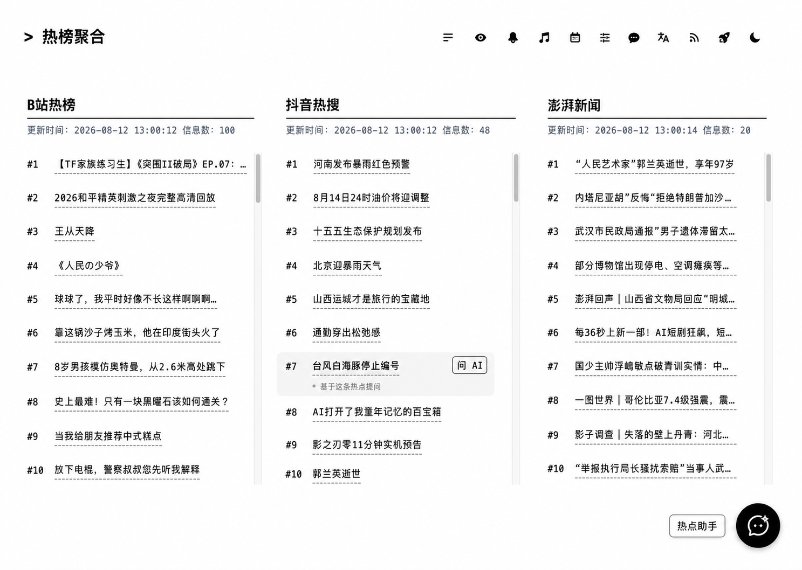
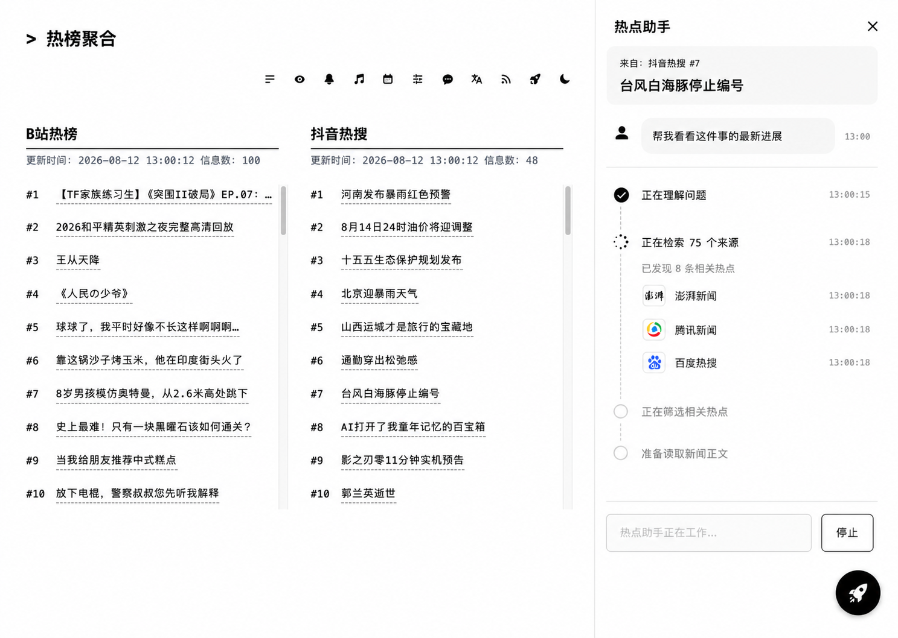
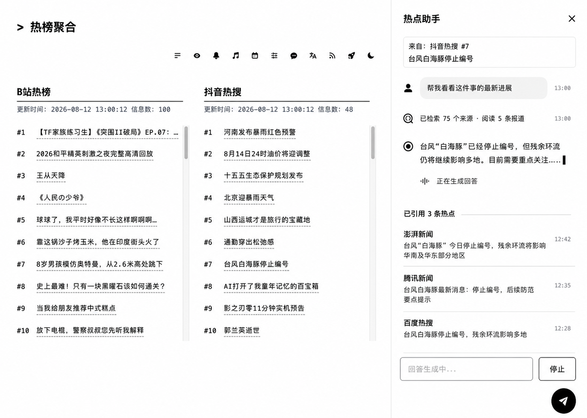
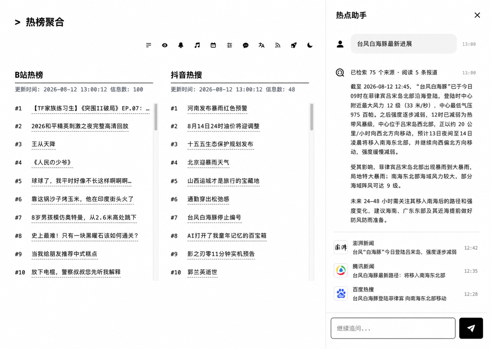
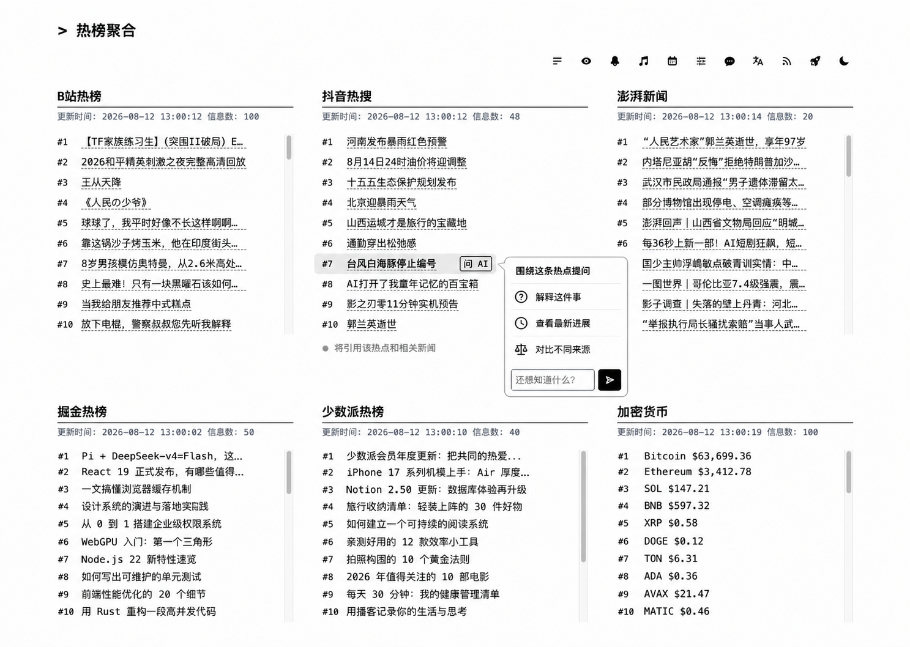
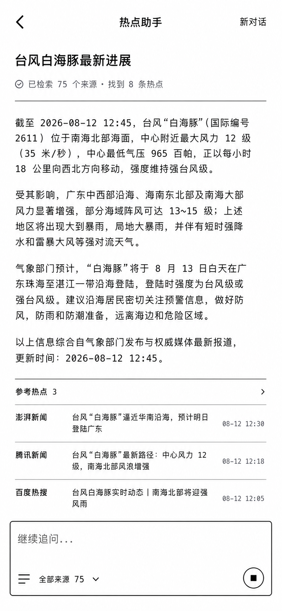

# Agent UI 视觉参考

本文档是 HotDay 热点助手前端实现的视觉基线。开发、评审和截图回归时，以这里收录的图片为主要参照。

## 参考优先级

出现冲突时按以下顺序处理：

1. 本文档中的状态图决定布局、层级、组件位置和主要交互形态；
2. HotDay 现有页面决定站点字体、颜色、间距和深浅色兼容方式；
3. [前端交互与埋点](frontend-ux-and-analytics.md) 决定状态机、可访问性和事件行为；
4. 附加的 `Frontend Design` 指南用于设计自检，不得借此重新发明截图中已经确定的视觉方案。

换句话说，这是一次 reference-first 的实现：先忠实还原，再在截图没有定义的地方使用设计指南补足细节。

## 核心方案

- 全局入口：页面右下角悬浮按钮，任何榜单位置都能打开热点助手；
- 上下文入口：热点条目旁提供“问 AI”，自动携带当前热点作为问题上下文；
- 桌面端容器：覆盖在榜单上方的右侧悬浮窗口，不占据页面布局空间，也不触发榜单重排；
- 移动端容器：全屏会话页；
- 同一时间只展示一个助手容器，两个入口复用同一会话和状态机。

## 状态 1：关闭

右下角仅展示悬浮按钮。按钮应醒目但不遮挡榜单内容，滚动页面时保持固定。

## 状态 2：检索中

打开右侧悬浮窗口后，明确展示 Agent 当前步骤，例如理解问题、检索来源、阅读报道。运行状态应传达进度，但不伪造精确百分比。

## 状态 3：流式回答

正文随着模型输出逐步出现；运行步骤收起为简洁状态，已获取的来源可以先展示。输入框在生成期间保留停止能力。

## 状态 4：回答完成

完成态保留引用来源、更新时间和继续追问入口。正文中的事实与下方来源应能对应，来源点击在新标签页打开。

## 补充入口与移动端

“问 AI”是榜单条目的上下文快捷入口，不取代全局悬浮按钮。

窄屏使用全屏布局，避免抽屉压缩榜单和回答正文。

## 从 Frontend Design 指南采用的规则

- 视觉决定必须服务于 HotDay 的“热点聚合与追踪”主题，而不是套用通用聊天产品模板；
- 结构元素需要表达真实信息：步骤只用于真实执行顺序，来源标签只表示真实来源；
- 动效集中在抽屉开合、步骤切换和流式光标，尊重 `prefers-reduced-motion`；
- 文案使用用户可理解的动作名称，例如“停止生成”“重新尝试”，不暴露内部工具名；
- 错误态说明发生了什么以及用户能做什么，不能只显示 `AGENT_FAILED`；
- 桌面、移动、键盘焦点和空状态都属于完成标准；
- 实现后必须以截图对照复盘一次，删掉没有信息价值的装饰。

## 不直接采用的规则

附件中的“做出独特视觉身份”“主动承担一个美学风险”适合从零创建设计，但不应覆盖本次复刻目标。当前页面的黑白榜单语言、细线分隔和克制排版本身就是既定方向，不额外引入新配色、展示字体或装饰性动效。

## Codex Skill 使用约定

本项目选用 [Taste Skill](https://github.com/leonxlnx/taste-skill) 仓库中的 `image-to-code`，用于执行“参考图分析 → 前端实现 → 截图回归”的复刻流程。

- 参考图已经确定时，不再生成新的主视觉方向；
- 先提取抽屉宽度、页面边距、字体层级、边框、按钮、状态与响应式规则，再修改代码；
- 截图不清楚的局部优先结合 HotDay 现有样式推导，不擅自套用 skill 的 landing page 默认值；
- 完成后在桌面和移动视口分别截图，与本文状态图进行视觉对照；
- `image-to-code` 是执行方法，本文图片仍是视觉真值；
- 不同时启用 `minimalist-ui`、`industrial-brutalist-ui`、`high-end-visual-design` 等风格 skill，避免覆盖现有产品语言。

桌面悬浮窗口默认距视口顶部、右侧和底部各 24px，宽度约 460px；使用完整细边框、克制圆角和柔和阴影表达浮层关系。窗口覆盖在榜单之上，榜单仍保持用户原先选择的列数。移动端仍使用全屏布局。

仓库默认的 `design-taste-frontend` 明确以 landing page、portfolio 和 redesign 为主，并排除 dashboard、数据表格和多步骤产品 UI，因此不作为本功能的默认实现规则。

## 实现验收

- 关闭、检索中、流式回答、完成、错误五个状态可独立复现；
- 悬浮按钮和“问 AI”入口都能打开同一个助手；
- 桌面悬浮窗口不修改榜单列数，未被覆盖的榜单区域仍可操作，移动端不出现横向滚动；
- 流式增量不会造成整块正文闪烁或页面频繁跳动；
- 来源、停止、重试、关闭均支持键盘操作并有可见焦点；
- 视觉回归截图与本文参考图逐项对照，而不是只检查功能是否可用。
